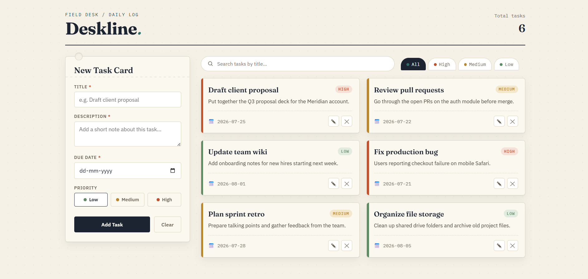
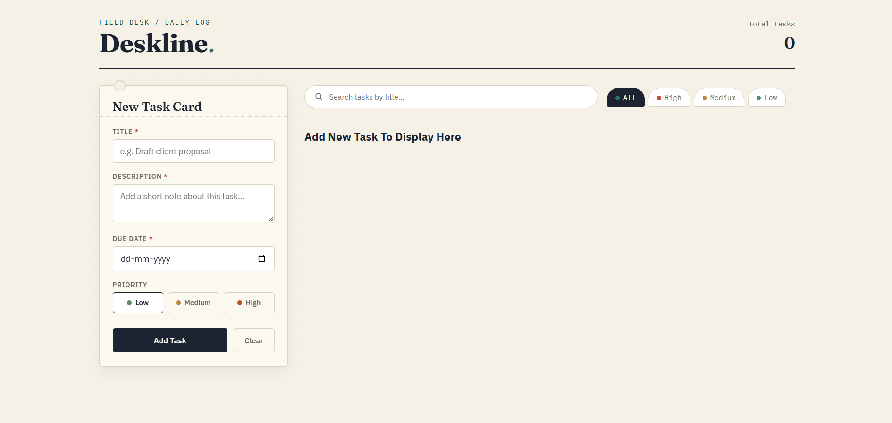

<div align="center">

# Project : Task Manager

**A clean, card-based Task Management System built with HTML, CSS and JavaScript that lets a user create, view, edit, delete, filter and search tasks with everything persisted locally using the browser's Local Storage.**

</div>

---

## 📑 Table of Contents

- [Project Description](#-project-description)
- [How This Project is Made](#-how-this-project-is-made)
- [Features](#-features)
- [Technologies Used](#-technologies-used)
- [JavaScript Concepts Covered](#-javascript-concepts-covered)
- [How It Works](#-how-it-works)
- [Project Structure](#-project-structure)
- [Screenshot](#-screenshot)
- [Demo](#-demo)
- [Author](#-author)

---

## 📌 Project Description

Deskline is a single-page Task Management System built using **HTML**, **CSS** and **JavaScript**. A user can add a task with a title, description, due date and priority, then view all tasks as a set of index-card-style entries on the page. Tasks can be edited, deleted, filtered by priority and searched by title all without a backend, using the browser's `localStorage` to keep the data around across page refreshes.

This project was built as a practical exam to demonstrate core JavaScript fundamentals: full CRUD (Create, Read, Update, Delete) operations on an array of objects, DOM manipulation to render that data dynamically, form validation and persisting application state with Local Storage.

---

## 🚀 How This Project is Made

This project is built using HTML, CSS and JavaScript to create a working **Task Manager**.

### 🧱 HTML Structure

- A single page holds a header with the app name and a live "Total tasks" counter, a sticky form card for adding/editing tasks, and a task list area on the right.
- The form collects a **title**, **description**, **due date** and a **priority** (Low / Medium / High) chosen from a custom-styled set of radio buttons.
- The task list area has a **search box** for filtering tasks by title, and a row of **tabs** (All / High / Medium / Low) built from hidden radio inputs, used to filter tasks by priority.
- Tasks themselves are rendered into a responsive `.grid` container, one `<article>` card per task.

### 🎨 CSS Styling

- An editorial "index card" theme is built using CSS custom properties for paper, ink, teal accent, and priority colors (green for Low, amber for Medium, terracotta for High).
- Each task card gets a colored left-edge stripe and a matching priority tag based on its priority level.
- The form card is styled to look like a punch card, with a sticky position so it stays visible while scrolling through the task list.
- Flexbox and CSS grid are used for the toolbar (search + tabs) and the auto-filling task grid.
- A responsive layout collapses the two-column board into a single column on smaller screens.

### ⚙️ JavaScript Functionality

- Tasks are stored as an array of objects, each with a unique `id` (generated with `Date.now()`), and are read from / written to `localStorage` under the key `"Tasks"`.
- The `addTask()` function either pushes a brand-new task object or, if an edit is in progress, replaces the task at its stored index — then saves the updated array back to Local Storage.
- The `displayTask()` function renders the full task list dynamically as HTML template strings, showing an empty-state message when there are no tasks.
- The `editTask()` function looks up a task by its `id`, pre-fills the form with that task's data, and switches the submit button to "Update Task" mode.
- The `deleteTask()` function removes a task by `id`, after a confirmation prompt, and re-renders the list.
- The `filter()` function filters tasks by priority when a tab is clicked, and a `currentFilter` variable remembers the active tab so that adding, editing, or deleting a task keeps the user on the same filtered view instead of resetting to "All".
- A live `input` listener on the search box filters the visible tasks by title as the user types.
- Due-date validation prevents a task from being added/updated with a date earlier than today.

---

## ✨ Features

- Add a new task with title, description, due date and priority
- View all tasks as dynamically rendered cards
- Edit an existing task (pre-fills the form, updates in place)
- Delete a task with a confirmation prompt
- Filter tasks by priority (All / High / Medium / Low tabs)
- Live search tasks by title
- Data persists across page refreshes using Local Storage
- Due date validation (no past dates allowed)
- Form and priority selection reset automatically after adding/editing a task
- Live "Total tasks" counter in the header

---

## 🔧 Technologies Used

- HTML5
- CSS3
- JavaScript (ES6)
- Browser `localStorage` API

---

## 📚 JavaScript Concepts Covered

- Functions
- Arrow Functions
- Template Literals
- DOM Manipulation
- Event Listeners
- Conditional Statements
- Array Methods (`forEach`, `filter`, `splice`, spread `[...tasks]`)
- CRUD Operations (Create, Read, Update, Delete)
- Local Storage (`getItem`, `setItem`, `JSON.parse`, `JSON.stringify`)
- Unique ID Generation (`Date.now()`)
- Date Object Methods & Comparison (`setHours`, date validation)
- Form Handling & Input Validation
- State Tracking with Variables (`editId`, `index`, `currentFilter`)

---

## 🔄 How It Works

### 📝 Adding a Task

- The user fills in the title, description, due date and priority, then submits the form.
- The due date is validated against today's date; a task cannot be added with a past due date.
- The new task is added to the `tasks` array with a unique `id` and saved to Local Storage.
- The form clears and resets to its default state (Low priority, empty fields) after a successful add.

### 📋 Displaying Tasks

- On page load, tasks are read from Local Storage and rendered as cards showing the title, description, due date and a color-coded priority tag.
- If there are no tasks yet, a friendly empty-state message is shown instead.

### ✏️ Editing a Task

- Clicking the edit icon on a task card prompts for confirmation, then pre-fills the form with that task's existing data.
- The submit button changes to "Update Task"; submitting the form replaces the original task with the updated values while keeping the same `id`.

### 🗑️ Deleting a Task

- Clicking the delete icon prompts for confirmation, then removes that task from the array and from Local Storage.
- The task list re-renders immediately, respecting whichever priority tab was active at the time.

### 🎯 Filtering by Priority

- Clicking the All / High / Medium / Low tabs filters the displayed tasks to that priority level.
- The currently active tab is remembered, so adding, editing or deleting a task afterwards keeps the same filtered view instead of jumping back to "All".

### 🔍 Searching by Title

- Typing into the search box filters the visible tasks live, matching against the task title.

---

## 📂 Project Structure

```text
task-manager/
│
├── assets/
│    ├── css/
│    │    └── style.css
│    └── output/
│         ├── output-1.png
│         └── output-2.png
├── index.html
└── README.md
```

---

## 📸 Screenshot

### Task Manager - With Tasks


### Task Manager - No Tasks


---

## 🎬 Demo

| | |
|---|---|
| 🔗 Live Demo | [Task Manager Website](https://task-manager-website-project.netlify.app/) |
| 🔗 Project Video | [Task Manager Video](https://drive.google.com/file/d/1B3KX8Ch9Zk3mOnKbq5PUJhUDO0VQG1i6/view?usp=drive_link) |
| 🎥 Project Explanation Video | [Explanation Video](#) |

---

## 💻 Author

<div align="center">

**Sakina Sendhi**

[](https://github.com/sakinasendhi52)

⭐ Thank you for visiting this repository!

</div>
